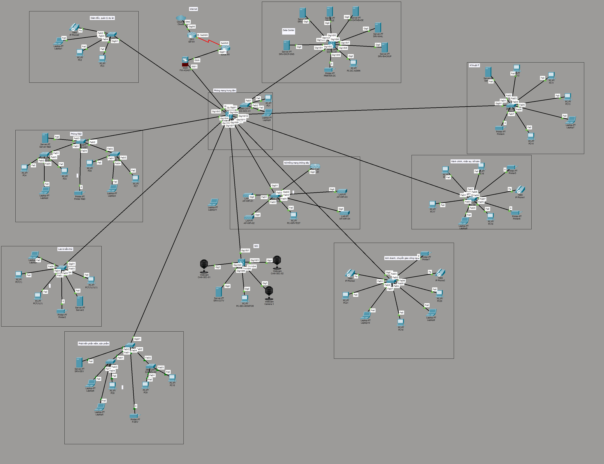

# SCITECH Enterprise Network — Cisco Packet Tracer

Mô hình mạng doanh nghiệp dành cho khoảng **100–120 người dùng**, được xây dựng trên Cisco Packet Tracer. Hệ thống gồm ISP, EDGE Router, ASA Firewall, Core Layer 3, Data Center, Wi-Fi, CCTV/IoT, Voice và các phòng ban. Toàn bộ kết nối đã được kiểm tra end-to-end thành công.



## Mục lục

- [Sơ đồ tổng quan](#sơ-đồ-tổng-quan)
- [Tài khoản lab](#tài-khoản-lab)
- [VLAN và phân hoạch địa chỉ](#vlan-và-phân-hoạch-địa-chỉ)
- [Mạng biên](#mạng-biên)
- [Uplink CORE-SW01](#uplink-core-sw01)
- [IP quản trị](#ip-quản-trị)
- [Data Center](#data-center)
- [DHCP](#dhcp)
- [Wi-Fi](#wi-fi)
- [Các khu vực và phòng ban](#các-khu-vực-và-phòng-ban)
- [Tài liệu riêng theo khu vực](#tài-liệu-riêng-theo-khu-vực)
- [NAT/PAT và ICMP inspection](#natpat-và-icmp-inspection)
- [Static route](#static-route)
- [Lệnh kiểm tra](#lệnh-kiểm-tra)
- [Lỗi thường gặp và cách xử lý](#lỗi-thường-gặp-và-cách-xử-lý)
- [Trạng thái hoàn thành](#trạng-thái-hoàn-thành)
- [Cấu trúc repository đề xuất](#cấu-trúc-repository-đề-xuất)

## Sơ đồ tổng quan

```text
INTERNET-CLOUD
      ↓
    ISP-R1
      ↓
   EDGE-R1
      ↓
  FW-ASA01
      ↓
  CORE-SW01
      ↓
Các switch phòng ban
```

## Tài khoản lab

| Hạng mục | Giá trị |
| --- | --- |
| Console password | `Console@123` |
| Enable secret | `Enable@123` |
| SSH username | `admin` |
| SSH password | `Admin@123` |
| Domain | `scitech.local` |
| RSA modulus | `1024` |

> **Lưu ý:** Các mật khẩu trên chỉ dùng trong bài mô phỏng Packet Tracer, không dùng cho hệ thống thật.

## VLAN và phân hoạch địa chỉ

| VLAN | Tên | Mạng | Gateway |
| ---: | --- | --- | --- |
| 10 | `BOARD_PROJECT` | `10.10.10.0/24` | `10.10.10.1` |
| 20 | `RD` | `10.10.20.0/24` | `10.10.20.1` |
| 30 | `LAB_TEST` | `10.10.30.0/24` | `10.10.30.1` |
| 40 | `SOFTWARE_DEV` | `10.10.40.0/24` | `10.10.40.1` |
| 50 | `IT_NOC` | `10.10.50.0/24` | `10.10.50.1` |
| 60 | `ADMIN_HR` | `10.10.60.0/24` | `10.10.60.1` |
| 70 | `ACCOUNTING` | `10.10.70.0/24` | `10.10.70.1` |
| 80 | `SALES_TRANSFER` | `10.10.80.0/24` | `10.10.80.1` |
| 90 | `SERVER` | `10.10.90.0/24` | `10.10.90.1` |
| 100 | `MANAGEMENT` | `10.10.100.0/24` | `10.10.100.1` |
| 110 | `WIFI_STAFF` | `10.10.110.0/24` | `10.10.110.1` |
| 120 | `WIFI_GUEST` | `10.10.120.0/24` | `10.10.120.1` |
| 130 | `CCTV_IOT` | `10.10.130.0/24` | `10.10.130.1` |
| 140 | `VOICE` | `10.10.140.0/24` | `10.10.140.1` |
| 999 | `NATIVE_BLACKHOLE` | Không cấp IP | Không có |

## Mạng biên

| Thiết bị | Cổng/Interface | Vai trò | Địa chỉ IP |
| --- | --- | --- | --- |
| `ISP-R1` | `Se0/0/0` | Kết nối tới `EDGE-R1` | `203.0.113.1/30` |
| `EDGE-R1` | `Se0/0/0` | Kết nối tới `ISP-R1` | `203.0.113.2/30` |
| `EDGE-R1` | `Gi0/1` | Kết nối tới ASA outside | `10.255.255.1/30` |
| `FW-ASA01` | `Vlan2/E0/0` | outside | `10.255.255.2/30` |
| `FW-ASA01` | `Vlan1/E0/1` | inside | `10.255.254.1/30` |
| `CORE-SW01` | `Gi1/0/1` | Routed port tới ASA inside | `10.255.254.2/30` |

Subnet mask của mạng `/30` là `255.255.255.252`.

## Uplink CORE-SW01

| Cổng CORE-SW01 | Thiết bị đầu xa | Kiểu kết nối | VLAN cho phép |
| --- | --- | --- | --- |
| `Gi1/0/1` | `FW-ASA01` inside | Routed port | Không áp dụng |
| `Gi1/0/2` | `SW-DC-01` | Trunk | `50,90,100,999` |
| `Gi1/0/3` | `SW-BOARD-01` | Trunk | `10,100,140,999` |
| `Gi1/0/4` | `SW-RD-DIST` | Trunk | `20,100,999` |
| `Gi1/0/5` | `SW-WIFI-01` | Trunk | `100,110,120,999` |
| `Gi1/0/6` | `SW-LAB-01` | Trunk | `30,100,999` |
| `Gi1/0/7` | `SW-DEV-DIST` | Trunk | `40,100,999` |
| `Gi1/0/8` | `SW-SEC-01` | Trunk | `100,130,999` |
| `Gi1/0/9` | `SW-IT-01` | Trunk | `50,100,999` |
| `Gi1/0/10` | `SW-HR-01` | Trunk | `60,70,100,140,999` |
| `Gi1/0/11` | `SW-SALES-01` | Trunk | `80,100,140,999` |
| `Gi1/0/12` | `SW-NOC-01` | Trunk | `50,100,999` |

Tất cả các trunk sử dụng native VLAN `999`.

## IP quản trị

Default gateway quản trị: `10.10.100.1`.

| Thiết bị | IP quản trị |
| --- | --- |
| `SW-NOC-01` | `10.10.100.11` |
| `SW-BOARD-01` | `10.10.100.12` |
| `SW-DC-01` | `10.10.100.20` |
| `SW-RD-DIST` | `10.10.100.21` |
| `SW-RD-01` | `10.10.100.22` |
| `SW-RD-02` | `10.10.100.23` |
| `SW-WIFI-01` | `10.10.100.30` |
| `SW-LAB-01` | `10.10.100.31` |
| `SW-DEV-DIST` | `10.10.100.32` |
| `SW-DEV-01` | `10.10.100.33` |
| `SW-DEV-02` | `10.10.100.34` |
| `WLC` | `10.10.100.40` |
| `SW-IT-01` | `10.10.100.41` |
| `SW-HR-01` | `10.10.100.42` |
| `SW-SALES-01` | `10.10.100.43` |
| `SW-SEC-01` | `10.10.100.50` |

## Data Center

| Thiết bị | Địa chỉ IP | Chức năng |
| --- | --- | --- |
| `SRV-DHCP-DNS` | `10.10.90.10` | DHCP và DNS |
| `SRV-WEB` | `10.10.90.20` | Web |
| `SRV-FILE` | `10.10.90.30` | Lưu trữ tệp |
| `SRV-DATABASE` | `10.10.90.40` | Cơ sở dữ liệu |
| `SRV-MAIL` | `10.10.90.50` | Thư điện tử |
| `SRV-BACKUP` | `10.10.90.60` | Sao lưu |
| Printer Data Center | `10.10.90.70` | Máy in |
| PC Admin Data Center | `10.10.50.20` | Máy quản trị |

## DHCP

DNS dùng chung: `10.10.90.10`.

| Pool/VLAN | Start IP | Ghi chú |
| --- | --- | --- |
| `VLAN10` | `10.10.10.100` | — |
| `VLAN20` | `10.10.20.100` | — |
| `VLAN30` | `10.10.30.100` | — |
| `VLAN40` | `10.10.40.100` | — |
| `VLAN50` | `10.10.50.100` | — |
| `VLAN60` | `10.10.60.100` | — |
| `VLAN70` | `10.10.70.100` | — |
| `VLAN80` | `10.10.80.100` | — |
| `VLAN90` | `10.10.90.100` | — |
| `VLAN100_MGMT` | `10.10.100.100` | — |
| `VLAN100_WIFI_MGMT` | `10.10.100.150` | WLC Address: `10.10.100.40` |
| `VLAN110` | `10.10.110.100` | — |
| `VLAN120` | `10.10.120.100` | — |
| `VLAN130` | `10.10.130.150` | — |
| `VLAN140` | `10.10.140.100` | Gateway: `10.10.140.1` |

## Wi-Fi

| Hạng mục | Giá trị |
| --- | --- |
| WLC IP | `10.10.100.40` |
| Gateway | `10.10.100.1` |
| DNS | `10.10.90.10` |
| SSID nhân viên | `SCITECH-STAFF` |
| VLAN nhân viên | `110` |
| Bảo mật nhân viên | WPA2-PSK/AES |
| Mật khẩu nhân viên | `Staff@123` |
| SSID khách | `SCITECH-GUEST` |
| VLAN khách | `120` |
| Bảo mật khách | WPA2-PSK/AES |
| Mật khẩu khách | `Guest@123` |
| LAP | 4 LAP online |

## Các khu vực và phòng ban

| Khu vực | Switch/IP quản trị | Thiết bị IP tĩnh |
| --- | --- | --- |
| R&D | `SW-RD-DIST` `10.10.100.21`; `SW-RD-01` `10.10.100.22`; `SW-RD-02` `10.10.100.23` | `SRV-RD` `10.10.20.10`; Printer `10.10.20.20` |
| Lab | `SW-LAB-01` `10.10.100.31` | `SRV-LAB` `10.10.30.10`; Printer `10.10.30.20` |
| DEV | `SW-DEV-DIST` `10.10.100.32`; `SW-DEV-01` `10.10.100.33`; `SW-DEV-02` `10.10.100.34` | `SRV-DEV` `10.10.40.10`; Printer `10.10.40.20` |
| IT | `SW-IT-01` `10.10.100.41` | Server IT `10.10.50.30`; Printer IT `10.10.50.40` |
| Hành chính/Nhân sự/Kế toán | `SW-HR-01` `10.10.100.42` | `Printer5` `10.10.70.20`; `Printer6` `10.10.70.21` |
| Kinh doanh/Chuyển giao | `SW-SALES-01` `10.10.100.43` | `Printer7` `10.10.80.20` |
| CCTV | `SW-SEC-01` `10.10.100.50` | `SRV-CCTV` `10.10.130.10`; PC monitor `10.10.130.20`; Camera `10.10.130.101–103` |
| NOC | `SW-NOC-01` `10.10.100.11` | — |
| Board | `SW-BOARD-01` `10.10.100.12` | — |

## Tài liệu riêng theo khu vực

Mỗi khu vực có một README riêng để thuận tiện cập nhật:

| Khu vực | Tài liệu |
| --- | --- |
| NOC | [rooms/noc/README.md](./rooms/noc/README.md) |
| Board/Project | [rooms/board-project/README.md](./rooms/board-project/README.md) |
| Data Center | [rooms/data-center/README.md](./rooms/data-center/README.md) |
| Wi-Fi | [rooms/wifi/README.md](./rooms/wifi/README.md) |
| R&D | [rooms/rd/README.md](./rooms/rd/README.md) |
| Lab | [rooms/lab/README.md](./rooms/lab/README.md) |
| DEV | [rooms/dev/README.md](./rooms/dev/README.md) |
| IT | [rooms/it/README.md](./rooms/it/README.md) |
| Hành chính/Nhân sự/Kế toán | [rooms/hr-accounting/README.md](./rooms/hr-accounting/README.md) |
| Kinh doanh/Chuyển giao | [rooms/sales/README.md](./rooms/sales/README.md) |
| CCTV/IoT | [rooms/cctv-iot/README.md](./rooms/cctv-iot/README.md) |

## NAT/PAT và ICMP inspection

### NAT/PAT trên FW-ASA01

```cisco
object network LAN-INTERNAL
 subnet 10.10.0.0 255.255.0.0
 nat (inside,outside) dynamic interface
```

### ICMP inspection

```cisco
class-map inspection_default
 match default-inspection-traffic
policy-map global_policy
 class inspection_default
  inspect icmp
service-policy global_policy global
```

## Static route

### CORE-SW01

```cisco
ip route 0.0.0.0 0.0.0.0 10.255.254.1
```

### FW-ASA01

```cisco
route outside 0.0.0.0 0.0.0.0 10.255.255.1
route inside 10.10.0.0 255.255.0.0 10.255.254.2
```

### EDGE-R1

```cisco
ip route 0.0.0.0 0.0.0.0 203.0.113.1
ip route 10.10.0.0 255.255.0.0 10.255.255.2
```

### ISP-R1

```cisco
ip route 10.10.0.0 255.255.0.0 203.0.113.2
ip route 10.255.255.0 255.255.255.252 203.0.113.2
```

## Lệnh kiểm tra

```cisco
show vlan brief
show interfaces trunk
show ip interface brief
show ip route
show ip arp
show nat
show xlate
ping
```

## Lỗi thường gặp và cách xử lý

| Hiện tượng | Nguyên nhân/Cách xử lý |
| --- | --- |
| Trunk forwarding `none` | Kiểm tra native VLAN và allowed VLAN ở cả hai đầu trunk. |
| SVI chưa `up` | Kiểm tra VLAN đã được tạo và có ít nhất một cổng hoạt động trong VLAN. |
| VLAN 130 thiếu trên Core | Tạo VLAN 130 trên `CORE-SW01` và kiểm tra trunk liên quan. |
| VLAN 140 sai gateway | Gateway đúng là `10.10.140.1`. |
| NAT hit bằng `0` | Tạo lưu lượng từ mạng inside và kiểm tra object NAT. |
| NAT có translation nhưng ping outside thất bại | Kiểm tra ICMP inspection và route trả về. |
| ISP thiếu route về `10.255.255.0/30` | Thêm route qua `203.0.113.2`. |
| `show conn` không hỗ trợ | Giới hạn của ASA trong Packet Tracer; dùng các lệnh kiểm tra được hỗ trợ. |
| Pipe `include` không hỗ trợ | Chạy lệnh đầy đủ rồi đọc kết quả trực tiếp. |
| Nhập `service-policy` sai mode | Nhập tại global configuration mode của ASA. |
| Ping lần đầu mất gói | Có thể do thiết bị đang thực hiện phân giải ARP; thử ping lại. |

## Trạng thái hoàn thành

- [x] Mạng biên
- [x] Core Layer 3
- [x] VLAN
- [x] Inter-VLAN
- [x] DHCP
- [x] DNS
- [x] Data Center
- [x] NOC
- [x] Board
- [x] R&D
- [x] Lab
- [x] DEV
- [x] IT
- [x] HR/Accounting
- [x] Sales
- [x] Wi-Fi
- [x] CCTV/IoT
- [x] Voice
- [x] NAT/PAT
- [x] ICMP inspection
- [x] Route trả về
- [x] End-to-end test

## Cấu trúc repository đề xuất

```text
.
├── README.md
├── packet-tracer/
│   └── scitech-enterprise-network.pkt
├── rooms/
│   ├── board-project/
│   ├── cctv-iot/
│   ├── data-center/
│   ├── dev/
│   ├── hr-accounting/
│   ├── it/
│   ├── lab/
│   ├── noc/
│   ├── rd/
│   ├── sales/
│   └── wifi/
└── screenshots/
```
